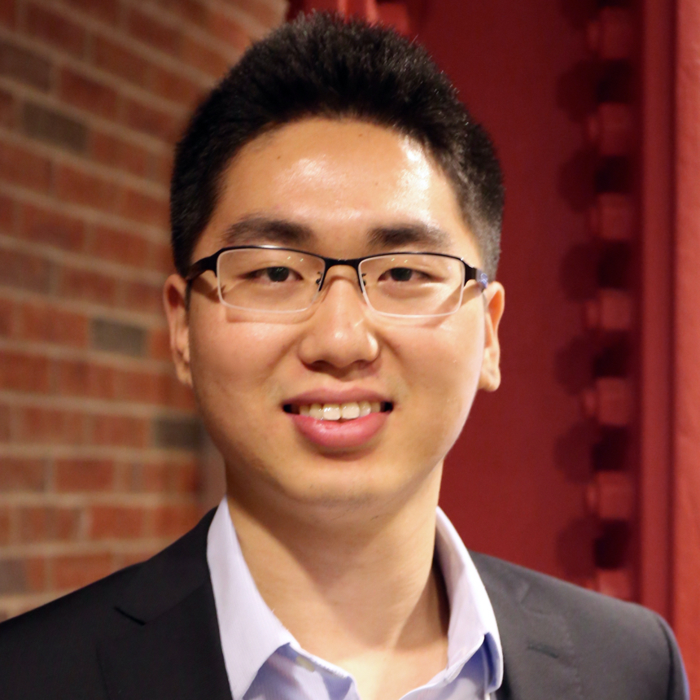
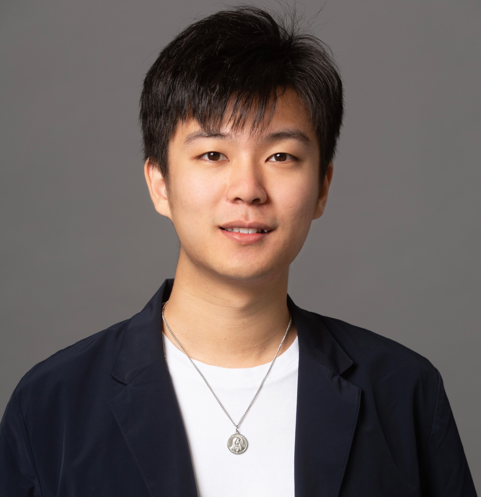

# WSDM2023_KnowledgeNLP_Tutorial

  

Materials for [WSDM2023](https://www.wsdm-conference.org/2023/) tutorial: Knowledge-Augmented Methods for Natural Language Processing

## Time and Location

1. Time: 8:30am - 12:00pm (GMT+8), February 27, 2023.

2. Location: Level 2, Empress 2 in Carlton Hotel, Singapore

3. Live Stream on Zoom: [\[Join stream\]](https://zoom.us/j/93670940327?pwd=aVArWW9XNVZWNmpwYUdXUS9uV3AvZz09#success)

## Tutorial Abstract 
Knowledge in NLP has been a rising trend especially after the advent of large scale pre-trained models. NLP models with attention to knowledge can i) access unlimited amount of external information; ii) delegate the task of storing knowledge from its parameter space to knowledge sources; iii) obtain up-to-date information; iv) make prediction results more explainable via selected knowledge. In this tutorial, we will introduce the key steps in integrating knowledge into NLP, including knowledge grounding from text, knowledge representation and fusing. We will also introduce recent state-of-the-art applications in fusing knowledge into language understanding, language generation and commonsense reasoning.

## Tutorial Materials

**1. Slides** [\[Introduction\]](https://github.com/zcgzcgzcg1/WSDM2023_Knowledge_NLP_Tutorial/blob/main/files/PART1_Introduction.pdf) [\[KnowledgeForNLU\]](https://github.com/zcgzcgzcg1/WSDM2023_Knowledge_NLP_Tutorial/blob/main/files/PART2_Knowledge_in_NLU.pdf) [\[KnowledgeForNLG\]](https://github.com/zcgzcgzcg1/WSDM2023_Knowledge_NLP_Tutorial/blob/main/files/PART4_Knowledge_in_NLG.pdf) [\[KnowledgeForCommonsense\]](https://github.com/zcgzcgzcg1/WSDM2023_Knowledge_NLP_Tutorial/blob/main/files/PART3_Commonsense_Reasoning.pdf) [\[Conclusion\]](https://github.com/zcgzcgzcg1/WSDM2023_Knowledge_NLP_Tutorial/blob/main/files/PART5_Conclusion.pdf)

**2. Video** Available after the tutorial

**3. Survey:** 

- A Survey of Knowledge-enhanced Text Generation, in ACM Computing Survey (CUSR) 2022. [\[PDF\]](https://arxiv.org/abs/2010.04389)

- Pre-train, Prompt, and Predict: A Systematic Survey of Prompting Methods in Natural Language Processing, in ACM Computing Survey (CUSR) 2023. [\[pdf\]](https://arxiv.org/pdf/2107.13586.pdf)

**4. Reading list:**

- KagNet: Knowledge-Aware Graph Networks for Commonsense Reasoning, in EMNLP 2019. [\[pdf\]](https://aclanthology.org/D19-1282)

- Birds have four legs?! NumerSense: Probing Numerical Commonsense Knowledge of Pre-Trained Language Models, in EMNLP 2020. [\[pdf\]](https://aclanthology.org/2020.emnlp-main.557)

- Differentiable Open-Ended Commonsense Reasoning, in NAACL 2021. [\[pdf\]](https://aclanthology.org/2021.naacl-main.366)

- CommonGen: A Constrained Text Generation Challenge for Generative Commonsense Reasoning, in EMNLP 2021. [\[pdf\]](https://aclanthology.org/2020.findings-emnlp.165/)

- Generate rather than Retrieve: Large Language Models are Strong Context Generators, in ICLR 2023. [\[pdf\]](https://arxiv.org/abs/2209.10063)

- Retrieval Augmentation for Commonsense Reasoning: A Unified Approach, in EMNLP 2022. [\[pdf\]](https://arxiv.org/abs/2210.12887)

- A Unified Encoder-Decoder Framework with Entity Memory, in EMNLP 2022. [\[pdf\]](https://arxiv.org/abs/2210.03273)

- Grape: Knowledge Graph Enhanced Passage Reader for Open-domain Question Answering, in EMNLP 2022. [\[pdf\]](https://arxiv.org/abs/2210.02933)

- KG-FiD: Infusing Knowledge Graph in Fusion-in-Decoder for Open-Domain Question Answering, in ACL 2022. [\[pdf\]](https://arxiv.org/abs/2110.04330)

- Dict-BERT: Enhancing Language Model Pre-training with Dictionary, in ACL 2022. [\[pdf\]](https://arxiv.org/abs/2110.06490)

- Fusing Context Into Knowledge Graph for Commonsense Question Answering, in ACL 2021. [\[pdf\]](https://arxiv.org/abs/2012.04808)

- Retrieval Enhanced Model for Commonsense Generation, in ACL 2021. [\[pdf\]](https://arxiv.org/abs/2105.11174)

- Diversifying Content Generation for Commonsense Reasoning with Mixture of Knowledge Graph Experts, in ACL 2022. [\[pdf\]](https://www.microsoft.com/en-us/research/uploads/prod/2022/03/ACL_2022_DGR_Camera.pdf)

- JAKET: Joint Pre-training of Knowledge Graph and Language Understanding, in AAAI 2022. [\[pdf\]](https://arxiv.org/abs/2010.00796)

- Boosting Factual Correctness of Abstractive Summarization with Knowledge Graph, in NAACL 2021. [\[pdf\]](https://arxiv.org/abs/2003.08612)

- REPLUG: Retrieval-Augmented Black-Box Language Models, on ArXiv 2023. [\[pdf\]](https://arxiv.org/abs/2301.12652) 

## Tutorial schedule (Tentative)

| Local time (GMT+8) | Content | Presenter | Slides |
| :---: | :---: | :---: | :---: |
| 08:30-08:45 | Motivation and Introduction of Knowledge in NLP | Chenguang Zhu | [\[Slides\]](https://github.com/zcgzcgzcg1/WSDM2023_Knowledge_NLP_Tutorial/blob/main/files/PART1_Introduction.pdf) |
| 08:45-09:35 | Knowledge in Natural Language Understanding  | Yichong Xu | [\[Slides\]](https://github.com/zcgzcgzcg1/WSDM2023_Knowledge_NLP_Tutorial/blob/main/files/PART2_Knowledge_in_NLU.pdf) |
| 09:35-10:00 | Commonsense Knowledge and Reasoning for NLP | Yuchen Lin & Xiang Ren | [\[Slides\]](https://github.com/zcgzcgzcg1/WSDM2023_Knowledge_NLP_Tutorial/blob/main/files/PART3_Commonsense_Reasoning.pdf) |
| 10:00-10:30 | Coffee Break  | - | - |
| 10:30-10:55 | Commonsense Knowledge and Reasoning for NLP | Yuchen Lin & Xiang Ren | (cont.) |
| 10:55-11:45 | Knowledge in Natural Language Generation | Wenhao Yu | [\[Slides\]](https://github.com/zcgzcgzcg1/WSDM2023_Knowledge_NLP_Tutorial/blob/main/files/PART4_Knowledge_in_NLG.pdf) |
| 11:45-12:00 | Summary and Future Direction | Meng Jiang | [\[Slides\]](https://github.com/zcgzcgzcg1/WSDM2023_Knowledge_NLP_Tutorial/blob/main/files/PART5_Conclusion.pdf) |

## Presenters

## &nbsp;  &nbsp;  &nbsp;   &nbsp;  &nbsp;  &nbsp;  

Chenguang Zhu &nbsp; &nbsp; &nbsp; Yichong Xu &nbsp; &nbsp; &nbsp; &nbsp; &nbsp; Xiang Ren &nbsp; &nbsp; &nbsp; &nbsp; &nbsp; Yuchen Lin &nbsp; &nbsp; &nbsp; &nbsp; Meng Jiang &nbsp; &nbsp; &nbsp; &nbsp; Wenhao Yu

**[Chenguang Zhu](https://www.microsoft.com/en-us/research/people/chezhu/)** is a Principal Research Manager in Microsoft Cognitive Services Research Group, where he leads the Knowledge & Language Team. His research in NLP covers knowledge graph, text summarization and task-oriented dialogue. He has led teams to achieve first places in multiple NLP competitions, including CommonsenseQA, CommonGen, FEVER, CoQA, ARC and SQuAD v1.0. He holds a Ph.D. degree in Computer Science from Stanford University. Dr. Zhu has given talks at Stanford University, Carnegie Mellon University and University of Notre Dame. He has previously been TA for Coursera online class “Automata”, giving teaching sessions to 100K international students. 

**[Yichong Xu](https://www.microsoft.com/en-us/research/people/yicxu/)** is a Senior Researcher in Knowledge \& Language Team in Microsoft Cognitive Services Research Group. His research in NLP focuses on using external knowledge to help natural language processing, including question answering, commonsense reasoning, and text summarization. Dr. Xu received his Ph.D. in Machine Learning from Carnegie Mellon University. During his time at CMU, he has been TA for large classes (>200 students) on machine learning and convex optimization. Dr. Xu has given talks at CMU AI Seminar, as well as in many international conferences including ACL, NAACL, NeurIPS, ICML, etc.

**[Xiang Ren](https://shanzhenren.github.io/)** is an assistant professor at the USC Computer Science Department, a Research Team Leader at USC ISI, and the PI of the Intelligence and Knowledge Discovery (INK) Lab at USC. Priorly, he received his Ph.D. in Computer Science from the University of Illinois Urbana-Champaign. Dr. Ren works on knowledge acquisition and reasoning in natural language processing, with focuses on developing human-centered and label-efficient computational methods for building trustworthy NLP systems. Ren publishes over 100 research papers and delivered over 10 tutorials at the top conferences in natural language process, data mining, and artificial intelligence. He received NSF CAREER Award, The Web Conference Best Paper runner-up, ACM SIGKDD Doctoral Dissertation Award, and several research awards from Google, Amazon, JP Morgan, Sony, and Snapchat. He was named Forbes' Asia 30 Under 30 in 2019.

**[Bill Yuchen Lin](https://yuchenlin.xyz/)** is a Postdoctoral Young Investigator at Allen Institute for AI (AI2), advised by Prof. Yejin Choi. He received his PhD from University of Southern California in 2022, advised by Prof. Xiang Ren. His research goal is to teach machines to think, talk, and act with commonsense knowledge and commonsense reasoning ability as humans do. Towards this ultimate goal, he has been developing knowledge-augmented reasoning methods (e.g., KagNet, MHGRN, DrFact) and constructing benchmark datasets (e.g., CommonGen, RiddleSense, X-CSR) that require commonsense knowledge and complex reasoning for both NLU and NLG. He initiated an online compendium of commonsense reasoning  research, which serves as a portal for the community. 

**[Meng Jiang](http://www.meng-jiang.com/)** is currently an assistant professor at the Department of Computer Science and Engineering in the University of Notre Dame. He obtained his B.E. and Ph.D. from Tsinghua University. He spent two years in UIUC as a postdoc and joined ND in 2017. His research interests include data mining, machine learning, and natural language processing. He has published more than 100 peer-reviewed papers of these topics. He is the recipient of Notre Dame International Faculty Research Award. The honors and awards he received include best paper finalist in KDD 2014, best paper award in KDD-DLG workshop 2020, and ACM SIGSOFT Distinguished Paper Award in ICSE 2021. He received NSF CRII award in 2019 and CAREER award in 2022.

**[Wenhao Yu](https://wyu97.github.io/)** is a Ph.D. candidate in the Department of Computer Science and Engineering at the University of Notre Dame. His research lies in language model + knowledge for solving knowledge-intensive applications, such as open-domain question answering and commonsense reasoning. He has published over 15 conference papers and presented 3 tutorials in machine learning and natural language processing conferences, including ICLR, ICML, ACL and EMNLP. He was the recipient of Bloomberg Ph.D. Fellowship in 2022 and won the best paper award at SoCal NLP in 2022. He was a research intern in Microsoft Research and Allen Institute for AI.
